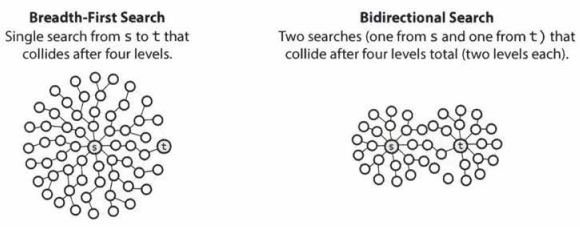

# Solution 1 - Breadth-First Search (BFS)

### Algorithm

1. Model this problem as a graph.
1. Each word in our provided list can be represented by a node.
1. If 2 words differ by only 1 letter, there is an edge between these words/nodes.
1. Instead of immediately creating this graph, we will create just the parts we need as we BFS from 1 word to another.

Detail mentioned in problem: Each transformed word must exist in the word list. Note that `beginWord` is not a transformed word.

### Code

```java
class Solution {
    public int ladderLength(String beginWord, String endWord, List<String> wordList) {
        if (beginWord == null || endWord == null || wordList == null || beginWord.length() != endWord.length()) {
            return 0;
        }
        Set<String> words = new HashSet<>(wordList);
        if (!words.contains(endWord)) {
            return 0;
        }
        if (beginWord.equals(endWord)) { // optional for Solution #1
            return 1;
        }

        Deque<String> deque = new ArrayDeque(); // use as queue
        Set<String> visited = new HashSet();

        deque.add(beginWord);
        visited.add(beginWord);
        int distance = 1;

        while (!deque.isEmpty()) {
            int wordsInLevel = deque.size();
            for (int i = 0; i < wordsInLevel; i++) {
                String word = deque.removeFirst();
                if (word.equals(endWord)) {
                    return distance;
                }
                for (String neighbor : getNeighbors(word, words)) {
                    if (!visited.contains(neighbor)) {
                        visited.add(neighbor);
                        deque.add(neighbor);
                    }
                }
            }
            distance++;
        }
        return 0; // no transformation sequence exists
    }

    // Generates all possible neighbors of given String
    private Set<String> getNeighbors(String str, Set<String> words) {
        Set<String> validWords = new HashSet();
        for (int i = 0; i < str.length(); i++) {
            char[] neighbor = str.toCharArray();
            for (char ch = 'a'; ch <= 'z'; ch++) {
                neighbor[i] = ch;
                String word = new String(neighbor);
                if (words.contains(word)) {
                    validWords.add(word);
                }
            }
        }
        validWords.remove(str); // original String is not its own neighbor
        return validWords;
    }
}
```
### Follow-up: How create actual solution path?

1. Use a `HashMap<String, String> backtrackMap`.
1. When adding a neighbor to our `visited` set, we would add it to our `backtrackMap` as well. The "key" would be the neighbor word, and the "value" would be the current word.
1. If a solution is found, we could reconstruct the solution path from `backtrackMap`.

### Time/Space Complexity

Let `m` be length of longest word and `n` be number of words in dictionary

- Time Complexity:  O(m<sup>2</sup>n)
    - getNeighbors is O(26m<sup>2</sup>) = O(m<sup>2</sup>)
    - Loop will dequeue at most n words, each of which take m<sup>2</sup> time to process (to get its neighbors)
- Space Complexity: O(mn)
    - `Set<String> words` requires O(mn) space.
    - `getNeighbors()` returns `Set<String>` requiring O(m<sup>2</sup>) space, but it cannot return more words than originally provided as input in the problem, so O(m<sup>2</sup>) < O(mn).

# Solution 2 - Bidirectional Search

[Bidirectional Search](http://theoryofprogramming.com/2018/01/21/bidirectional-search/) uses 2 simultaneous BFS searches to find the distance between 2 nodes (by alternating between the searches)



For BFS, if `d` is the distance between the 2 nodes, and `b` is the branching factor, 1 way to represent the runtime is O(b<sup>d</sup>).

For Bidirectional search, the runtime is O(b<sup>(d/2)</sup>) + O(b<sup>(d/2)</sup>) = O(2*b<sup>(d/2)</sup>) = O(b<sup>(d/2)</sup>) since each search only has to search halfway before meeting the other search.

### Applying Bidirectional Search to our original solution

1. Our original solution used 1 `Deque` as a queue, and 1 `Set` to mark visited Strings. Since we are running 2 BFS searches, we will make 2 of these `Deque`s and 2 of these `Sets`.
1. To simulate 2 BFS searches "simultaneously", we alter between which of the 2 `Deque`s we deque from.
1. We now have 2 `Deque`s to deque from, and 2 "visited" `Set`s, but we don't want to duplicate code. We will create  a general function called `checkNeighbors()` that takes a `Deque` and `Set` as input, to help us alternate between the 2 BFS searches.
1. If at any time a String gets dequed, and one of its neighbors has already been visited from the opposite side's parallel search, we've found a solution.

### Code

Code below is inspired from this [StackOverflow code](https://stackoverflow.com/a/39782065/10146735)

```java
class Solution {
    public int ladderLength(String beginWord, String endWord, List<String> wordList) {
        if (beginWord == null || endWord == null || beginWord.length() != endWord.length()) {
            return 0;
        }
        Set<String> words = new HashSet<>(wordList);
        if (!words.contains(endWord)) {
            return 0;
        }
        if (beginWord.equals(endWord)) { // crucial for Solution #2
            return 1;
        }

        Deque<String> deque1 = new ArrayDeque(); // use as queue
        Deque<String> deque2 = new ArrayDeque(); // use as queue

        Set<String> visited1 = new HashSet();
        Set<String> visited2 = new HashSet();

        deque1.add(beginWord);
        deque2.add(endWord);

        visited1.add(beginWord);
        visited2.add(endWord);

        int distance = 2;

        while (!deque1.isEmpty() || !deque2.isEmpty()) {
            if (checkNeighbors(deque1, visited1, visited2, words)) {
                return distance;
            }
            distance++;
            if (checkNeighbors(deque2, visited2, visited1, words)) {
                return distance;
            }
            distance++;
        }
        return 0; // no transformation sequence exists
    }

    private boolean checkNeighbors(Deque<String> deque,
                                   Set<String> visitedFromThisSide,
                                   Set<String> visitedFromThatSide,
                                   Set<String> words) {
        int wordsInLevel = deque.size();
        for (int i = 0; i < wordsInLevel; i++) {
            String word = deque.removeFirst();
            for (String neighbor : getNeighbors(word, words)) {
                if (visitedFromThatSide.contains(neighbor)) {
                    return true;
                }
                if (!visitedFromThisSide.contains(neighbor)) {
                    visitedFromThisSide.add(neighbor);
                    deque.add(neighbor);
                }
            }
        }
        return false;
    }

    // Generates all possible neighbors of given String
    private Set<String> getNeighbors(String str, Set<String> words) {
        Set<String> validWords = new HashSet();
        for (int i = 0; i < str.length(); i++) {
            char[] neighbor = str.toCharArray();
            for (char ch = 'a'; ch <= 'z'; ch++) {
                neighbor[i] = ch;
                String word = new String(neighbor);
                if (words.contains(word)) {
                    validWords.add(word);
                }
            }
        }
        validWords.remove(str); // original String is not its own neighbor
        return validWords;
    }
}
```

### Additional Notes

I believe Bidirectional search is an excellent candidate for parallel processing. We can use 2 threads, 1 for each search. To know when the 2 searches have collided, the visited nodes from each thread would need to be available to the other thread. Theoretically, we could have these 2 `Set`s of visited nodes saved somewhere that's accessible by both threads.

### Time/Space Complexity

- Time Complexity: O(b<sup>(d/2)</sup>) as explained at beginning of Solution 2. In our case, `b` is the max size of the `Set` returned by `getNeighbors()`, making `b = O(26m) = O(m)` where `m` is length of longest word.
- Space Complexity: Same as in Solution 1.


# Links

- [Discuss on LeetCode](https://leetcode.com/problems/word-ladder/discuss/345900)
- [github.com/RodneyShag](https://github.com/RodneyShag)
